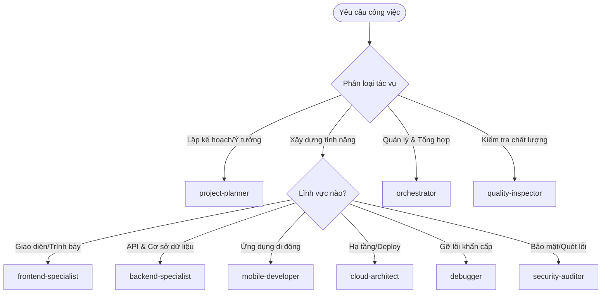

# 🤖 Hướng Dẫn Lựa Chọn & Sử Dụng Agent Chuyên Gia (Agents Guide)

Tài liệu này hướng dẫn chi tiết các trường hợp sử dụng phù hợp cho từng Agent trong số **13 Agent Chuyên Gia Cốt Lõi** của hệ thống Antigravity. Bạn có thể sao chép tài liệu này để làm cẩm nang tra cứu khi cần điều phối công việc.

---

## 🧭 Bản Đồ Trực Quan Lựa Chọn Agent nhanh

---

## 📋 Chi Tiết Từng Agent & Trường Hợp Áp Dụng

### 1. ⚓ `orchestrator` (Thuyền Trưởng / Điều Phối Viên)
*   **Trường hợp phù hợp (Use Cases):**
    *   Cần điều phối một tác vụ lớn, phức tạp cần sự tham gia của 3 agent trở lên (ví dụ: tạo chức năng thanh toán hoàn chỉnh).
    *   Tổng hợp kết quả công việc sau khi các Agent Worker hoàn thành code.
    *   Tự động hóa việc ghi nhận lỗi hệ thống và tối ưu quy trình làm việc.
*   **Khi nào không nên dùng:** Các tác vụ nhỏ, đơn lẻ (như sửa một lỗi cú pháp, đổi màu nút bấm).

### 2. 🛡️ `quality-inspector` (Thanh Tra Chất Lượng)
*   **Trường hợp phù hợp (Use Cases):**
    *   Trước khi gộp nhánh code (Merge Pull Request) hoặc bàn giao sản phẩm.
    *   Kiểm tra tính gắn kết của mã nguồn, chạy linter, format code và kiểm tra lỗi logic.
    *   Tự động quét và đối soát các tiêu chí nghiệm thu (Acceptance Criteria) trong kế hoạch.
*   **Khi nào không nên dùng:** Trong lúc đang viết code dang dở (vì code chưa hoàn thiện sẽ báo nhiều lỗi lặt vặt).

### 3. 📐 `project-planner` (Kiến Trúc Sư Dự Án)
*   **Trường hợp phù hợp (Use Cases):**
    *   Nhận một yêu cầu nghiệp vụ mơ hồ và cần bóc tách thành kế hoạch kỹ thuật cụ thể.
    *   Viết tài liệu PRD, phác thảo kiến trúc MVP ban đầu.
    *   Xác định các bên liên quan và phân chia lộ trình phát triển thành các giai đoạn (Phases).
*   **Khi nào không nên dùng:** Khi công việc đã có kế hoạch rõ ràng và chỉ cần bắt tay vào viết code.

### 4. ⚙️ `backend-specialist` (Chuyên Gia Hệ Thống)
*   **Trường hợp phù hợp (Use Cases):**
    *   Thiết kế hoặc sửa đổi cấu trúc bảng cơ sở dữ liệu (Database Schema).
    *   Xây dựng các API Endpoint mới, viết logic nghiệp vụ xử lý dữ liệu phức tạp.
    *   Tối ưu hóa các truy vấn SQL chậm hoặc xử lý bất đồng bộ (Queue, Job).
*   **Khi nào không nên dùng:** Khi cần làm giao diện web, căn chỉnh CSS hay xử lý hiệu ứng phía client.

### 5. 🎨 `frontend-specialist` (Chuyên Gia Giao Diện)
*   **Trường hợp phù hợp (Use Cases):**
    *   Xây dựng các component UI bằng React, Next.js, HTML/CSS.
    *   Tối ưu điểm số hiệu năng tải trang (Lighthouse/Core Web Vitals).
    *   Cấu hình giao diện responsive (tương thích máy tính, máy tính bảng và điện thoại).
*   **Khi nào không nên dùng:** Khi cần viết truy vấn cơ sở dữ liệu trực tiếp hoặc cấu hình VPS/Server.

### 6. 🔒 `security-auditor` (Chuyên Gia Bảo Mật)
*   **Trường hợp phù hợp (Use Cases):**
    *   Kiểm tra mã nguồn để phát hiện các lỗ hổng bảo mật phổ biến (SQL Injection, XSS, CSRF).
    *   Cấu hình cơ chế mã hóa mật khẩu, phân quyền người dùng (RBAC) và xác thực (OAuth/JWT).
    *   Quét và phát hiện các thông tin nhạy cảm bị lộ (API Key, Mật khẩu hardcode).
*   **Khi nào không nên dùng:** Khi viết các tính năng nghiệp vụ thông thường không liên quan đến bảo mật hoặc phân quyền.

### 7. 🧪 `test-engineer` (Kỹ Sư Kiểm Thử)
*   **Trường hợp phù hợp (Use Cases):**
    *   Viết unit tests cho các hàm logic cốt lõi.
    *   Cấu hình các kịch bản kiểm thử tự động E2E (End-to-End) bằng Playwright/Cypress.
    *   Áp dụng quy trình kiểm thử trước viết code sau (TDD Red-Green-Refactor).
*   **Khi nào không nên dùng:** Khi giao diện hoặc logic nghiệp vụ còn đang thay đổi liên tục chưa định hình.

### 8. ☁️ `cloud-architect` (Kiến Trúc Sư Điện Toán Đám Mây)
*   **Trường hợp phù hợp (Use Cases):**
    *   Viết kịch bản tự động hóa Deploy (GitHub Actions, GitLab CI).
    *   Docker hóa ứng dụng (viết Dockerfile, docker-compose).
    *   Cấu hình hạ tầng đám mây dạng mã (Terraform) và thiết lập cân bằng tải (Load Balancer).
*   **Khi nào không nên dùng:** Khi lập trình logic ứng dụng thuần túy không đụng chạm đến môi trường chạy.

### 9. 🔍 `codebase-expert` (Chuyên Gia Phân Tích Codebase)
*   **Trường hợp phù hợp (Use Cases):**
    *   Tiếp nhận một dự án cũ (legacy code) và cần hiểu nhanh cấu trúc thư mục, các mối quan hệ import.
    *   Tìm kiếm mã nguồn bị trùng lặp để gộp lại hoặc loại bỏ nợ kỹ thuật (technical debt).
    *   Đánh giá tác động (Impact Analysis) của một thay đổi lớn lên toàn bộ hệ thống.
*   **Khi nào không nên dùng:** Khi cần tạo mới một tính năng hoàn toàn độc lập không liên quan đến code cũ.

### 10. 📱 `mobile-developer` (Chuyên Gia Ứng Dụng Di Động)
*   **Trường hợp phù hợp (Use Cases):**
    *   Xây dựng màn hình ứng dụng đặt vé trên điện thoại bằng React Native hoặc Flutter.
    *   Cấu hình các tính năng native của thiết bị di động (Camera, GPS, Đẩy thông báo Push Notification).
    *   Chuẩn bị tài liệu đóng gói ứng dụng để đưa lên Apple App Store hoặc Google Play Store.
*   **Khi nào không nên dùng:** Khi phát triển trang web chạy trên trình duyệt máy tính thông thường.

### 11. 🎮 `game-developer` (Chuyên Gia Phát Triển Game)
*   **Trường hợp phù hợp (Use Cases):**
    *   Xây dựng các mini-game tương tác để thu hút người dùng đặt vé (ví dụ: vòng quay may mắn nhận voucher).
    *   Tích hợp các mô hình và hiệu ứng 3D động lên trang web (sử dụng Three.js / WebGL).
*   **Khi nào không nên dùng:** Khi lập trình các biểu mẫu điền dữ liệu (Form) hoặc trang quản trị (Admin Dashboard) truyền thống.

### 12. 🐞 `debugger` (Chuyên Gia Gỡ Lỗi)
*   **Trường hợp phù hợp (Use Cases):**
    *   Ứng dụng bị sập đột ngột (Crash/Runtime Error) và cần đọc stack trace để tìm nguyên nhân gốc rễ.
    *   Xử lý các tình huống nghẽn tiến trình (deadlock) hoặc rò rỉ bộ nhớ (memory leak).
    *   Viết các bản sửa lỗi nóng (hotfix) trực tiếp trên Production.
*   **Khi nào không nên dùng:** Khi viết code mới từ đầu hoặc chỉnh sửa thẩm mỹ giao diện.

### 13. 📈 `seo-specialist` (Chuyên Gia Tối Ưu Tìm Kiếm)
*   **Trường hợp phù hợp (Use Cases):**
    *   Tối ưu hóa các thẻ Meta, cấu trúc HTML Heading (H1-H6) chuẩn SEO.
    *   Cấu hình cấu trúc dữ liệu JSON-LD (Schema Markup) để Google hiểu thông tin vé sự kiện.
    *   Tối ưu hóa trải nghiệm tìm kiếm bằng trí tuệ nhân tạo (GEO) để app hiển thị trong câu trả lời của ChatGPT/Perplexity.
*   **Khi nào không nên dùng:** Khi lập trình logic xác thực tài khoản hoặc kết nối cổng thanh toán.
