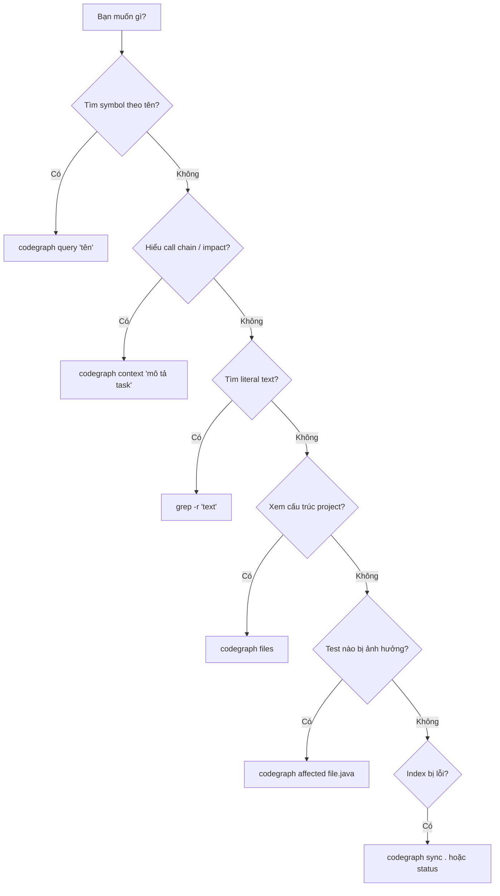

# 🧭 CodeGraph Training

> **CodeGraph** = knowledge graph parse AST bằng tree-sitter.
> Hiểu cấu trúc code (symbols, call graph, imports) — không chỉ tìm text.

---

## 📋 Mục lục

1. [Khái niệm cốt lõi](#-khái-niệm-cốt-lõi)
2. [Decision Tree — chọn lệnh nào?](#-decision-tree--chọn-lệnh-nào)
3. [Cài đặt](#-step-1-cài-đặt)
4. [Khởi tạo index](#-step-2-khởi-tạo-index)
5. [Kiểm tra trạng thái](#-step-3-codegraph-status)
6. [Xem cấu trúc project](#-step-4-codegraph-files)
7. [Tìm symbol](#-step-5-codegraph-query)
8. [Build context](#-step-6-codegraph-context--lệnh-quan-trọng-nhất)
9. [Sync sau khi sửa code](#-step-7-codegraph-sync)
10. [Lệnh nâng cao](#-lệnh-nâng-cao)
11. [So sánh vs tools khác](#-codegraph-thay-thế-gì)
12. [Config cho Java/Kotlin](#-config-cho-javakotlin)
13. [Workflow thực tế](#-workflow-thực-tế)
14. [Troubleshooting](#-troubleshooting)
15. [Tips](#-tips)

---

## 🧠 Khái niệm cốt lõi

### CodeGraph hoạt động như thế nào?

```
Source Code → [tree-sitter parser] → AST → [CodeGraph] → SQLite DB (nodes + edges)
```

1. **Parse:** Tree-sitter đọc mỗi file, tạo Abstract Syntax Tree (giống IntelliJ PSI tree)
2. **Extract:** Từ AST, trích xuất **nodes** (class, method, function, interface, field, import...) và **edges** (gọi, import, kế thừa...)
3. **Store:** Lưu vào SQLite DB tại `.codegraph/`
4. **Query:** Khi bạn hỏi, nó tìm trong graph — không scan text

### Thuật ngữ

| Thuật ngữ | Nghĩa | Ví dụ Java/Kotlin |
|-----------|--------|-------------------|
| **Node** | 1 symbol trong code | `class UserService`, `fun generateId()` |
| **Edge** | Quan hệ giữa 2 nodes | `UserController` → calls → `UserService.createUser()` |
| **Caller** | Ai gọi symbol này | `register()` là caller của `createUser()` |
| **Callee** | Symbol này gọi ai | `createUser()` gọi `repository.save()` (callee) |
| **Impact** | Nếu đổi X, đâu bị ảnh hưởng | Đổi `UserRepository.save()` → ảnh hưởng `UserService` → `UserController` |

### Tại sao không dùng grep?

```bash
grep -r "createUser" .
# → Match cả: comments, strings, log messages, tên biến khác
# → Bỏ sót: method overload, alias import

codegraph query "createUser"
# → Chỉ trả symbol thật (method/function definition + usages từ AST)
# → Biết chính xác loại (method/class/field), file:line, quan hệ
```

---

## 🗺️ Decision Tree — chọn lệnh nào?



**Quick reference:**

| Tình huống | Lệnh |
|-----------|------|
| "Class X ở đâu?" | `codegraph query "X"` |
| "Ai gọi method Y?" | `codegraph context "callers of Y"` |
| "Đổi Z sẽ hỏng gì?" | `codegraph context "impact of changing Z"` |
| "Tìm annotation @Async" | `grep -r "@Async"` (literal text → grep) |
| "Project có những file gì?" | `codegraph files` |
| "Test nào cần chạy lại?" | `codegraph affected <file>` |

---

## 🔧 Step 1: Cài đặt

```bash
npm install -g @colbymchenry/codegraph
```

**Fix backend chậm (WASM → native):**

```bash
# Corporate proxy chặn SSL? Tạm tắt:
npm config set strict-ssl false
npm install -g better-sqlite3
npm config set strict-ssl true
```

✅ **Thử ngay:** Chạy `codegraph --version` — nếu ra version number là OK.

---

## 🏗️ Step 2: Khởi tạo index

```bash
cd your-project/
codegraph init -i
```

**Cơ chế:**
- Quét tất cả file match patterns trong `config.json`
- Parse mỗi file bằng tree-sitter → tạo AST
- Extract nodes (symbols) + edges (relationships) → ghi vào SQLite
- Tạo thư mục `.codegraph/` chứa DB + config

**Sau khi init, thêm vào `.gitignore`:**

```
.codegraph/
```

> Mỗi developer tự build index local — index phụ thuộc vào absolute path nên không share được.

✅ **Thử ngay:** `cd` vào project Java/Kotlin của bạn, chạy `codegraph init -i`.

---

## 📊 Step 3: `codegraph status`

**Tác dụng:** Kiểm tra sức khỏe của index — có up-to-date không, dùng backend gì, bao nhiêu symbols đã index.

**Cơ chế:** Đọc metadata trong SQLite DB, so sánh timestamp file vs last-indexed time.

```bash
codegraph status
```

**Output mẫu (Java project):**

```
Index Statistics:
  Files:     42          ← số file đã parse
  Nodes:     156         ← tổng symbols (class + method + field + import...)
  Edges:     289         ← tổng quan hệ (calls + imports + extends...)
  Backend:   native      ← native = nhanh, wasm = chậm 5-10x

Nodes by Kind:
  class          15      ← bao nhiêu class
  method         78      ← bao nhiêu method
  field          32
  import         31

Files by Language:
  java           30
  kotlin         12

[OK] Index is up to date  ← không có file nào thay đổi chưa được index
```

**Đọc kết quả:**
- `Backend: native` → tốt. `wasm` → quay lại Step 1 cài `better-sqlite3`
- `[OK]` → khỏe. `stale` → chạy `codegraph sync .`
- `Files: 0` → config exclude quá nhiều, check `config.json`

✅ **Thử ngay:** Chạy `codegraph status` trong project của bạn.

---

## 🌳 Step 4: `codegraph files`

**Tác dụng:** Hiển thị file tree từ index — tương tự `tree` command nhưng kèm thông tin language + số symbols mỗi file.

**Cơ chế:** Query DB lấy danh sách file nodes, render thành tree format.

**Khác gì `find` / `tree`?**
- `tree` / `find`: liệt kê mọi file kể cả `build/`, `node_modules/`
- `codegraph files`: chỉ file đã index, kèm symbol count → biết file nào phức tạp

```bash
codegraph files
```

**Output mẫu:**

```
`-- src/main
    |-- java/com/example
    |   |-- controller
    |   |   `-- UserController.java (java, 8 symbols)
    |   |-- service
    |   |   `-- UserService.java (java, 12 symbols)   ← file phức tạp nhất
    |   |-- repository
    |   |   `-- UserRepository.java (java, 4 symbols)
    |   `-- model
    |       `-- User.java (java, 6 symbols)
    `-- kotlin/com/example
        `-- util
            `-- IdGenerator.kt (kotlin, 3 symbols)
```

✅ **Thử ngay:** `codegraph files` — file nào có nhiều symbols nhất trong project bạn?

---

## 🔍 Step 5: `codegraph query`

**Tác dụng:** Tìm symbol theo tên — trả về vị trí chính xác (file:line), loại (class/method/field), và relevance score.

**Cơ chế:**
1. Nhận keyword từ bạn
2. Fuzzy search trong bảng nodes (SQLite FTS)
3. Rank theo relevance (exact match > partial > substring)
4. Trả về top matches kèm loại + location

**Khác gì IntelliJ "Navigate to Symbol" (Ctrl+Alt+Shift+N)?**
- IntelliJ: cần mở IDE, chỉ project đang load
- CodeGraph: CLI, chạy ở đâu cũng được, dùng trong script/CI

```bash
codegraph query "UserService"
```

**Output mẫu:**

```
Search Results for "UserService":

class       UserService (8200%)           ← loại: class, score cao = exact match
  src/main/java/.../UserService.java:12   ← file:line

import      com.example.service.UserService (540%)    ← cũng match ở import statement
  src/main/java/.../UserController.java:5
```

**Java examples:**
```bash
codegraph query "findById"        # Tìm method
codegraph query "UserRepository"  # Tìm interface/class
```

**Kotlin examples:**
```bash
codegraph query "generateId"      # Tìm function
codegraph query "UserDto"         # Tìm data class
```

**⚠️ Không tìm được:**
- Annotations (`@Transactional`) → dùng `grep -r "@Transactional"`
- String literals → dùng `grep`
- Comments/Javadoc → dùng `grep`

✅ **Thử ngay:** Chọn 1 class/method trong project, chạy `codegraph query "<tên>"`.

---

## ⭐ Step 6: `codegraph context` — lệnh quan trọng nhất

**Tác dụng:** Phân tích toàn bộ context xung quanh 1 task — tự động tìm symbols liên quan, trích source code, xây call chain, đánh giá impact. Output là markdown sẵn sàng cho AI đọc.

**Cơ chế:**
1. Parse câu mô tả task → nhận diện symbol names trong đó
2. Tìm symbol đó trong graph (như `query`)
3. Traverse edges: tìm callers (ai gọi) + callees (nó gọi gì)
4. Đọc source code của mỗi symbol liên quan
5. Compile thành markdown report có cấu trúc

**Tại sao đây là lệnh quan trọng nhất?**
- 1 lệnh `context` = thay thế chuỗi: `query` → mở file → đọc code → tìm caller → mở file khác...
- Output đủ để hiểu architecture mà không cần mở IDE

```bash
codegraph context "<mô tả task bằng tiếng Anh>"
```

**Java — "ai gọi `createUser` và đổi nó thì hỏng gì?"**

```bash
codegraph context "what calls createUser and what would break if signature changed"
```

**Output mẫu:**

```markdown
## Code Context

### Entry Points
- **createUser** (method) - src/main/java/.../UserService.java:25

### Related Symbols
- UserController.register:18 (caller)    ← ai GỌI nó
- UserRepository.save:4 (callee)         ← nó GỌI ai
- User.<init>:12 (callee)

### Code
#### createUser (UserService.java:25)
public User createUser(CreateUserDto dto) {
    validateEmail(dto.getEmail());
    User user = new User(generateId(), dto.getName(), dto.getEmail());
    return userRepository.save(user);
}

#### register (UserController.java:18)       ← caller source
@PostMapping("/users")
public ResponseEntity<User> register(@RequestBody CreateUserDto dto) {
    return ResponseEntity.ok(userService.createUser(dto));
}
```

**Kotlin — trace suspend function:**

```bash
codegraph context "what does fetchUserProfile call and its callers"
```

**Best practices:**
- ❌ `codegraph query "X"` → `codegraph query "Y"` → đọc file → lặp lại
- ✅ `codegraph context "relationship between X and Y"` — 1 lệnh đủ
- Viết task description bằng English cho parser hiểu tốt hơn
- Càng mô tả cụ thể → kết quả càng focused

✅ **Thử ngay:** Chọn 1 method quan trọng, chạy `codegraph context "what calls <method> and what it depends on"`.

---

## 🔄 Step 7: `codegraph sync`

**Tác dụng:** Cập nhật index cho file đã thay đổi kể từ lần index trước — incremental, nhanh hơn full re-index.

**Cơ chế:**
1. So sánh file modification time vs last-indexed timestamp trong DB
2. Chỉ re-parse file đã thay đổi
3. Update/delete/add nodes + edges tương ứng

**Khác gì `codegraph index`?**
- `sync .` → chỉ file changed (nhanh, dùng thường xuyên)
- `index .` → re-parse TẤT CẢ file (chậm, dùng khi index corrupted)

```bash
codegraph sync .
```

**⚠️ Index lag:** Sau khi save file, CodeGraph cần ~2 giây để detect thay đổi. Không query ngay lập tức sau khi edit.

✅ **Thử ngay:** Sửa 1 file, save, chạy `codegraph sync .`, rồi `codegraph status` confirm OK.

---

## 🚀 Lệnh nâng cao

### `codegraph affected` — tìm test bị ảnh hưởng

**Tác dụng:** Cho biết test files nào cần chạy lại khi bạn sửa 1 source file.

**Cơ chế:** Trace ngược từ file đã đổi → qua call graph → tìm test files (files chứa test annotations hoặc match `*Test.*` / `*Spec.*` pattern).

```bash
# Java
codegraph affected src/main/java/com/example/service/UserService.java

# Kotlin
codegraph affected src/main/kotlin/com/example/util/IdGenerator.kt
```

**Khác gì `./gradlew test --tests`?**
- Gradle: chạy all hoặc bạn tự guess test name
- CodeGraph: chính xác theo call graph, language-agnostic

### `codegraph serve` — MCP server cho AI

**Tác dụng:** Biến CodeGraph thành server mà AI tools (Claude, Cursor, Codex) gọi trực tiếp — AI tự tìm context thay vì bạn phải copy-paste.

```bash
codegraph serve
```

### `codegraph install` — cài vào AI tools

```bash
codegraph install    # Interactive: chọn Claude Code, Cursor, Codex...
```

### `codegraph unlock` — gỡ lock file

**Tác dụng:** Xóa lock file khi indexing bị crash/treo giữa chừng, khiến lệnh khác bị block.

```bash
codegraph unlock
```

---

## 🔄 CodeGraph thay thế gì?

| Tool truyền thống | CodeGraph thay bằng | Ưu điểm |
|---|---|---|
| `grep -r "ClassName"` | `codegraph query "ClassName"` | Chỉ match symbol thật, bỏ qua comments/strings |
| IntelliJ "Find Usages" (Ctrl+Alt+F7) | `codegraph context "callers of X"` | CLI, headless, dùng trong CI |
| IntelliJ "Call Hierarchy" (Ctrl+Alt+H) | `codegraph context "<task>"` | Full chain 1 lệnh |
| `ctags` / `etags` | `codegraph query` | Auto-sync, không cần regenerate |
| `find . -name "*.java"` | `codegraph files` | Kèm symbol count, language info |
| Gradle `--tests` (guess affected) | `codegraph affected` | Chính xác theo call graph |
| Manual trace (đọc → tìm import → đọc tiếp) | `codegraph context` | 1 lệnh xong |

**Vẫn cần grep/IntelliJ cho:**
- Tìm literal string: `"ERROR_CODE_001"`
- Tìm annotation: `@Transactional`, `@Inject`
- Tìm trong comments/Javadoc
- Tìm trong config files (XML, YAML, properties)

---

## ⚙️ Config cho Java/Kotlin

File `.codegraph/config.json` — đảm bảo include đúng patterns:

```json
{
  "version": 1,
  "include": [
    "**/*.java",
    "**/*.kt",
    "**/*.kts"
  ],
  "exclude": [
    "**/.git/**",
    "**/build/**",
    "**/out/**",
    "**/.gradle/**",
    "**/node_modules/**",
    "**/generated/**",
    "**/*Test.java",
    "**/*Spec.kt"
  ]
}
```

> 💡 Bỏ 2 dòng `*Test.java` / `*Spec.kt` nếu muốn index cả test files (cần cho `affected`).

---

## 🎯 Workflow thực tế

### Scenario 1: Refactor method trong Spring Boot

```bash
# 1. Tìm method
codegraph query "processPayment"

# 2. Full impact analysis
codegraph context "refactor processPayment - what calls it and what breaks"

# 3. Sửa code trong IDE...

# 4. Sync
codegraph sync .

# 5. Tìm test cần chạy lại
codegraph affected src/main/java/com/example/service/PaymentService.java
```

### Scenario 2: Onboard project Kotlin mới

```bash
# 1. Init
codegraph init -i

# 2. Overview
codegraph status
codegraph files

# 3. Tìm entry point
codegraph query "main"
codegraph query "Application"

# 4. Trace architecture
codegraph context "application startup flow and main dependencies"
```

### Scenario 3: Review PR — hiểu impact

```bash
# File trong PR đã thay đổi
codegraph affected src/main/java/com/example/repository/UserRepository.java

# Xem cụ thể method nào bị ảnh hưởng
codegraph context "what depends on UserRepository.findByEmail"
```

---

## 🔧 Troubleshooting

| Vấn đề | Nguyên nhân | Fix |
|---------|-------------|-----|
| `Backend: wasm` | Thiếu `better-sqlite3` native | `npm install -g better-sqlite3` |
| Index stale | File đã sửa nhưng chưa sync | `codegraph sync .` |
| Lock file blocking | Indexing bị crash giữa chừng | `codegraph unlock` |
| Index corrupted | DB lỗi | Xóa `.codegraph/`, chạy `codegraph init -i` |
| Command not found | Chưa cài CLI | `npm install -g @colbymchenry/codegraph` |
| Không index .kt files | Config thiếu pattern | Check `config.json` include `"**/*.kt"` |
| Quá nhiều nodes | Index cả generated code | Thêm `generated/` vào exclude |
| Query trả kết quả sai | Index cũ | `codegraph sync .` rồi query lại |

---

## 💡 Tips

1. **Dùng `context` là chính** — 90% use case chỉ cần lệnh này
2. **Viết task description bằng English** — parser hiểu context tốt hơn
3. **Sync trước khi query** nếu vừa edit file
4. **Không cần verify bằng grep** — CodeGraph parse AST, chính xác hơn regex
5. **Thêm `.codegraph/` vào `.gitignore`** — index local, mỗi dev tự build
6. **Supported:** Java, Kotlin, TypeScript, JavaScript, Python, Go, Rust, C/C++, C#, PHP, Ruby, Swift, Dart, Scala

---

## 📱 Preview & Chia sẻ

File này là **Markdown chuẩn** — preview bằng:

| Cách | Tool |
|------|------|
| VS Code | Ctrl+Shift+V (Markdown Preview) |
| Web | Push lên GitHub/GitLab → tự render |
| Mobile | GitHub Mobile app, hoặc bất kỳ Markdown viewer |
| PDF | VS Code extension "Markdown PDF" → export |
| Offline | Typora, Obsidian, Notable |

> 💡 **Tip:** Mở trên GitHub Mobile khi cần tra cứu nhanh lệnh ngoài IDE.
