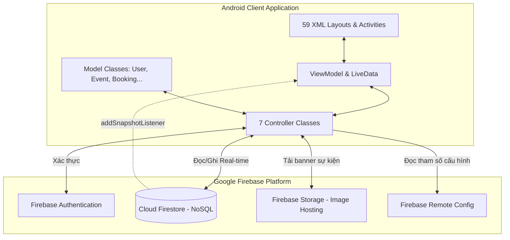
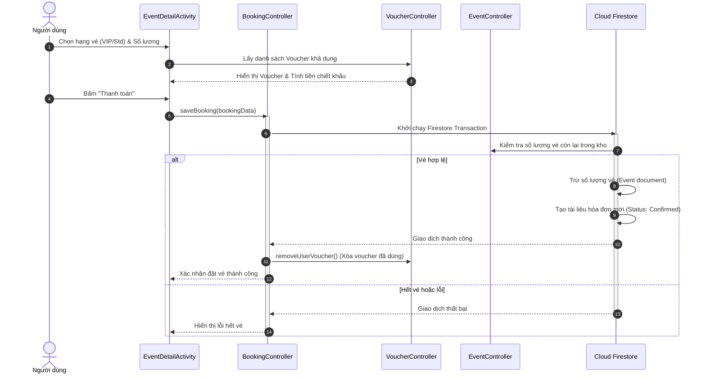
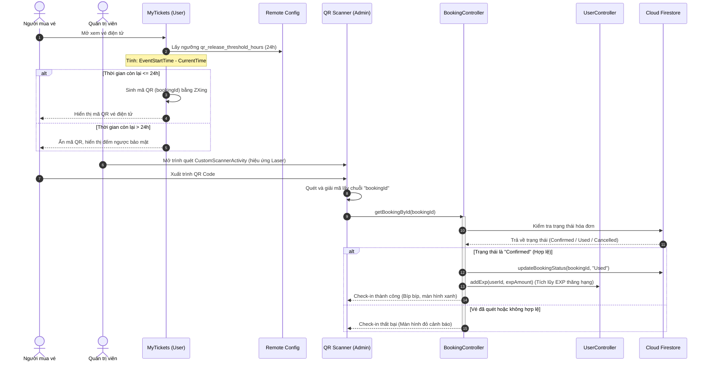

# 🗺️ Sơ đồ Kiến trúc & Luồng Dữ liệu - EventPass

Tài liệu này chứa các sơ đồ luồng trực quan mô tả cách các thành phần trong ứng dụng EventPass tương tác với nhau và với Firebase Backend.

---

## 1. Sơ đồ Kiến trúc Hệ thống (MVC + Firebase LiveData)

Sơ đồ dưới đây mô tả cấu trúc phân tầng của ứng dụng Android và cách thức giao tiếp reactive với Firebase Services:

---

## 2. Sơ đồ Luồng Đặt vé & Thanh toán (Booking & Payment)

Mô tả tuần tự cách thức thu thập dữ liệu từ giao diện người dùng, áp dụng voucher, chạy giao dịch Firestore và cập nhật số lượng vé:

---

## 3. Sơ đồ Luồng Quét QR Code & Check-in (Admin)

Mô tả luồng so sánh thời gian thực để kích hoạt mã QR trên app người dùng, và quy trình soát vé của quản trị viên:

